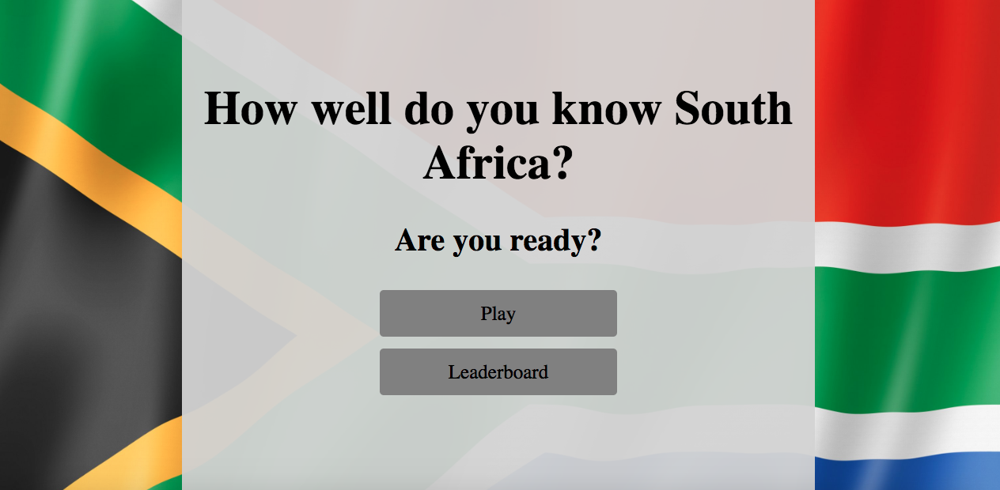
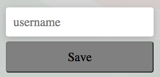

# SA Quiz

## Introduction

SA Quiz is designed to test the broad knowledge South African enthusiasts. 

The quiz site offers all the information users need to know about the quiz. This includes starting the quiz, the user's name,how many points you're accumulating,your time left on each progress and your progress through the set of questions.And finally, saving your high score and saving it into the leaderboard.

Website's live link [SA Quiz](https://katenowlan.github.io/SA-Quiz/index.html)

  

## UX

### The Strategy Plane

#### Site Goals
* To provide users with a fun and easy game to play.
* To ensure that navigating the site is easy and intuitive.
* To provide users with alternative difficulty levels.
* To ensure the game is fully responsive on all screen sizes.

### The Scope Plane

**Features Planned:**

* Responsive Design - The site should function correctly across all screen sizes.
* The site should be visually enticing.
* The game should be clear from the outset it is a quiz.

### The Skeleton Plane

#### Wireframe mockup 

##### Main home page

##### Main quiz page

### The Surface Plane

#### Design
I wanted to keep the colors minimal as to make it accesible to those with poorer/impaired vision.

##### Background Image
For the background i used a picture of the South African flag.This sets the theme and i feel is very apt and is not in contrast with the font or container housing the quiz as the container is grey and font black so this is great for users with any vision issues.

### Font Used:
  The font family used throughout this site is [Roboto](https://fonts.google.com/specimen/Roboto)

### Structure Plane

# Features
### SA Quiz consists of four separate HTML files: 
* A quiz introduction/starting page
     * The quiz introduction page has to "play" and "leaderboard" buttons.The "play" button enables you to start the quiz.
* The main quiz page
     * The main quiz page contains all the quiz questions and answers. It also shows your progress in a progress bar as well as having a timer for each question.
* The end page
     * The end page shows how many points you scored throughout the game.It allows you to enter your name and save your score,which will be on the leaderboard on the home page.There is a button to allow you to go home and a button allowing you to play again.
* Leaderboard page for scores
     * On the home page there is a button for Leaderboard. If you click this you will be taken to the page where it will show the top five highest scores.     

## Quiz Introduction(home) Page

* ### Start Quiz
 
   * By clicking the play button, the user will start the quiz.
  
  

 ## Main Quiz Page
  

 * ### Quiz Question Counter and Progress bar
    

   * Users can keep track of the number of questions left.

 * ### Quiz Scoring Points
     

   * For each correct answer you are allocated 100 points.

 * ### Questions And Answers
   * The quiz has four questions in total.
   * Each question has four choices.
   * The background color will turn green if the user answers correctly, and red if the user answers incorrectly.
   * After you have asnwered a question the next one will come up.
   * After answering all the questions, the user will be taken to the end page.

* ### End Page
   

  * The user can see how many points they scored.
  * They have the option to enter their name and save their score.  
    
  * The user has the option to then either play again or go back to the home page,where you can check your scores on the leadboard.

    

* ### End Page
   
   * Users can click on leaderboard to be redirected to this page where they can see their score. This leaderboard will hold up to 5 of the highest scores. Once user is done they can click home and will be redirected there.

### **Testing**
 -   This website works works on :

 Screens 400px and below
 
 Screens 700px and below

 Screens 900px and below

 Screens 1200px and below

 Screens 1200 and above

__Validator Testing__

   - W3C HTML

   - CSS Jigsaw

   

   - Javascript JSHint

   

   - Lighthouse 

    
    - Mobile screenshot

 

    
    - Desktop screenshot
    

  The website was tested on the following platforms to see if it worked:
  * Chrome
  * Safari
   
   ## Clone and Fork

### Clone 

* In Github, click on the project that you want to clone.
* Click to copy the URL.
* Open a new terminal.
* Change the current working directory to the location that you want the cloned directory.
* Type 'git clone' and paste the copied URL.
* Press 'Enter' to clone.

### Fork

* In Github, click on the project that you wish to fork.
* Click on the 'Fork' button at the top right of the page.

## Research

 * Websites sourced from Google used for information were:
 - Stack overflow
 - W3C

 ## Credit

 * Thanks must go to my mentor Okwudiri Okoro for all his guidance.

